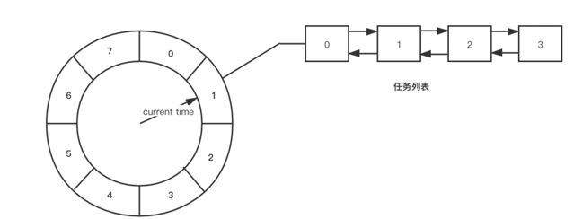
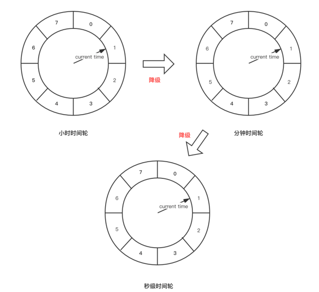

# TimeWheel
## 1、基本概念

用形象化的语法来说，时间轮就如同生活中的始终，始终以恒定的速度转动着秒针/分针/时针。
从具体实现来看，时间轮 是一个基于 「数组」 实现的 「循环队列」 ，数组的每个元素被称为 「槽（slot）」 ，每个槽中存储着一个 「任务列表」 ，这个任务列表的实现较为多样，可以是 「由双向链表实现」 ，也可以是 「由数组实现」。除了基本的存储结构，时间轮还有一根用于指示当前时间的指针，这根指针同时也用于触发所指向的时间槽内任务。该指针以恒定的速度旋转，每经过一个槽即走过一个单位时间 （所以也可以将槽称为时间槽，因为它即表示时间刻度，也表示存储空间），旋转一圈则走过时间轮的一个生命周期。以下是一张简答时间轮数据结构图：

    对于时间轮所采取的数据结构而言 （底层使用数组实现），在时间槽数量较大的情况下，插入任务和删除任务的时间复杂度近乎是O(1)。这里通过下面的例子来了解一下插入任务的具体逻辑：如上图，时间轮中的时间槽数量为8（单位时间为秒，即时间轮的周期为8秒），当前时间为1秒，现在要插入一个延迟5秒，则任务插入的位置为 Index = (Tc + Td) % N = (1 + 5) % 8 = 6 (其中Tc为当前时间，Td为延迟时间，N为时间轮的时间周期)。
    聪明的同学一定发现了，如果此时插入一个延迟10秒执行的时间，那么最终得到的Index就为3。但是按照当前的任务触发逻辑，指针只需要走两个时间槽就会触发这个延迟任务，和预期的延迟10秒再触发不符。那么应该如何解决这样一个问题呢？
    遇到这样一个问题，最直白的解决方案就是增加时间轮中时间槽的数量，这样上述的延迟任务就依然能放置在同一个轮次中。但是在日常开发工作中，延迟数小时甚至数日的任务都有可能存在，无限制的扩大时间槽的数量只会导致内存消耗的急剧增大，并不是一个十分优雅的解决方案。下面就让我们一起来看两种更为优雅的解决方案。

## 2. 基于轮次的时间轮
   上面的问题可以理解为是一种 「时间溢出」 ，基础的时间轮模型对于这种时间溢出问题是无法解决的，所以需要在基础的时间轮模型上进行升级。从上面的计算中可以得到，延迟10秒执行的任务实际上是在第二轮中的Index为3的位置进行触发，为了和第一轮中的任务进行区分，这里引进了 轮次 的概念。
   通过轮次的概念，可以准确区分每个任务所处的时间轮周期。还是上面的例子，延迟10秒的任务所处的轮次为 Round = (Tc + Td) / N = (1 + 10) / 8 = 1 ，任务插入的位置为3，那么当时间指针循环1圈后扫到下标为3的时间槽时就会触发这个延迟任务。
## 3. 多层级时间轮
   除了上面使用基于轮次的时间轮，优秀的大佬们（是前辈大佬，不是女装大佬）想出了另外一种形式的时间轮—— 「多层级的时间轮」 。下面是一个简单的数据结构图（单位换算请忽略，这里只是借用了秒分时的概念）：

多层级时间轮从逻辑上和我们日常使用的时钟颇为相似，上一层级的时间轮中的一个时间槽（单位时间）等于下一层级的时间轮的一个时间周期。
对于层次的算法其实和轮次相同，还是用上面的例子，类似的可以算出当前需要插入的延迟任务应该放在第二层时间轮中Index等于1的时间槽中，当最下层的时间轮走完一轮后，第二层时间轮中的指针就会指向Index为1的时间槽，此时会触发一次时间轮的 「降级」 。

「时间轮降级」：这里的降级是指当指针指向上一层级对应时间槽时，将对应时间槽中的任务取出，重新计算插入到下一层级时间轮的时间槽中。

通过 「多层级」 和 「降级」 的方式就可以解决延迟任务时间溢出的问题。

参考：https://juejin.cn/post/6878994558723162125
